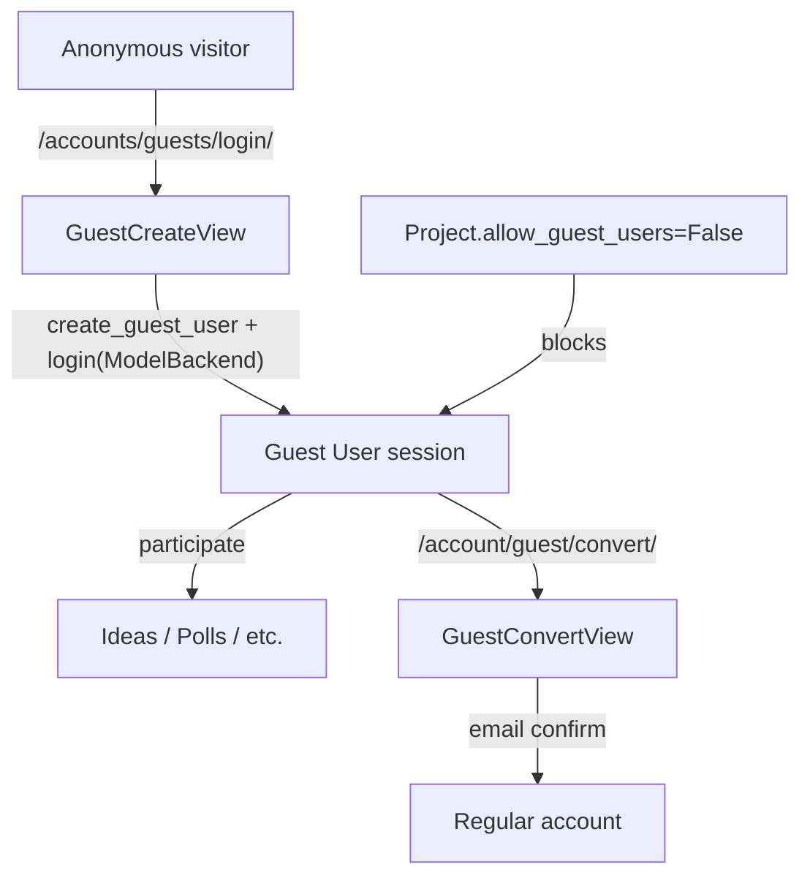

# Port Guest Users to meinBerlin

> **Status: ready for final review before build.** Companion docs: the permission spec + implementation notes live in [`docs/roles_and_permissions.md`](roles_and_permissions.md); the upstream a+ email fix is [`docs/aplus_guest_notification_emails.md`](aplus_guest_notification_emails.md). Overview: port the guest-user feature from adhocracy-plus (commits `c898b407` + `28ae9021`) into meinBerlin, adapting for meinBerlin's email-as-username auth, navigation, and account structure.

## Locked decisions (this review cycle)

| # | Decision | Choice |
|---|----------|--------|
| a4 pin | adhocracy4 dependency | **`@main`** for now; OK to ship on main (revisit an `mB-*` tag/SHA before release) |
| guest-user lib | dependency | **`liqd/django-guest-user@8fa934f`** (branch `jp-26-07-change-backend-for-auth`; secure guest login) |
| email domain | guest placeholder email | **Accept `guest+{username}@liqd.net`** (deliverable → email exclusion is mandatory) |
| username | public guest name | **Friendly `Guest####`** via `generate_numbered_username` |
| creation | how guests are made | **Explicit only** (`/accounts/guests/login/`); no transparent `@allow_guest_user`; likely **no** custom `GuestManager` override needed (verify by test) |
| follows | follow API for guests | **Hard-block server-side** (`IsRegularUser` subclass), not just hide the widget |
| allauth pages | `/accounts/email/`, `/accounts/password/change/` | **Close the gap in meinBerlin AND propose the fix upstream in a+** |
| deletion / expiry | guest account cleanup | **Contribution-aware daily cleanup** — `delete_expired_guests` command deletes guests >14d old with **no** participation content; run daily from the external admin repo (not celery beat) |
| convert nudging | prompting guests to convert | **None** for now |
| captcha | guest create form | **Reuse** existing `CaptcheckCaptchaField` |
| notifications | in-app vs email | **Create in-app rows; block UI/API/settings + outbound email while guest** |

Fork bugs fixed in `@8fa934f`: `IntegrityError` retry re-derives `email`/`password`; `create_guest_user(username=...)` binds `email`/`password`.

## Build checklist

- [x] Deps + settings: a4 `@main`, `django-guest-user@8fa934f`, `guest_user` app (**do not** register `GuestBackend`), `A4_ENABLE_GUEST_USERS`, `GUEST_USER*` settings (`GUEST_USER_NAME_SUFFIX_DIGITS=5`). No new meinberlin migration; `guest_user`'s `Guest` table + a4's `allow_guest_users` field ship with the packages (`makemigrations --check` clean).
- [x] Guest create: `GuestCreateView` + `GuestCreateForm` (terms + reused `CaptcheckCaptchaField`) + `/accounts/guests/login/` URL (name `guest_create`). `maybe_create_guest_user(request)` on submit (fork logs in via `ModelBackend`).
- [x] Shared primitives: `is_regular_user` / `is_regular_user_and_owner` predicates (`users/predicates.py`) + `IsRegularUser` DRF permission (`users/permissions.py`)
- [x] Rules + dashboard: `& guest_may_participate` added to the public participate branch in `projects/rules.py`; `allow_guest_users` rendered in the project basic form override
- [x] Convert: `GuestConvertView` + `/account/guest/convert/` (name `guest_convert`) + `GuestConvertForm`; `Guest` row deleted on `email_confirmed` signal
- [x] Gate account/settings: `RegularUserRequiredMixin` on `AccountView`, profile, notifications page, notification-settings, followed-projects, kiezradar settings views; `IsRegularUser` on notification APIs; `is_regular_user` in kiezradar rules
- [x] Follows: hard-block API via `FollowViewSet(IsRegularUser)` override (registered in `config/urls.py`) + hide the `react_follows` widget for guests
- [x] allauth gap: guests blocked from `account_email` / `account_change_password` / `account_set_password` via `regular_user_required`-wrapped overrides before the allauth include. (Upstream a+ proposal still TODO.)
- [x] Emails: `_exclude_guest_users` centrally in `contrib/emails.py` (`dispatch` shadows `get_receivers`, covering all meinBerlin email subclasses)
- [x] Kiezradar React: `isGuestUser` threaded plans view → template data attr → `react_plans_map` → `ProjectsListMapBox` → `ProjectsControlBar` → `SaveSearchProfile` (returns null for guests)
- [x] Header/nav + project guest alert: nav shows "Create an account" for guests, hides notifications + settings dropdown; project detail shows a guest participation alert; login page shows "Proceed as guest" when enabled
- [x] Tests + translations: `tests/users/test_guest_users.py` (22 tests, all green); `make po` re-extracted new strings
- [x] Cleanup: `delete_expired_guests` management command (>14d, no contributions, `--dry-run`); scheduled daily by the external admin repo, no celery beat entry

### Integration fix (fork `@8fa934f`)

- **Guest re-login hole (security)** — `GuestBackend` authenticates guests by identifier alone (password ignored). With it in `AUTHENTICATION_BACKENDS`, the login form accepted a guest identifier + any password. Public `Guest####` names made this exploitable.
  - **Fix in fork:** `maybe_create_guest_user` calls `login(..., backend=GUEST_USER_LOGIN_BACKEND)` (`ModelBackend`); `GuestBackend.authenticate()` returns `None`. Do **not** register `GuestBackend`. `guest_user.W001` now warns **if** the backend **is** registered.
  - **Apps:** omit `GuestBackend` from settings; `GuestCreateView` calls `maybe_create_guest_user(request)`.
  - Regression tests: `test_guest_cannot_be_authenticated_by_identifier_alone`, `test_guest_cannot_relogin_via_login_form`.

- **`PASSWORD_FIELD` on the User model** — legacy from `@cfee4f0`; harmless to keep on `User` (`PASSWORD_FIELD = "username"`). No longer read by guest login path after `@8fa934f`.

## Reference implementation

Source: [adhocracy-plus](file:///Users/josh/projects/adhocracy-plus) commits `c898b407` (core guest feature) and `28ae9021` (per-project `allow_guest_users`). Built on `[liqd/django-guest-user@8fa934f](https://github.com/liqd/django-guest-user)` and adhocracy4 framework support (now on a4 `main` as `e8362f685`).

meinberlin currently has **zero guest-related code**. First dependency change: point a4 at `@main` in `[requirements/base.txt](requirements/base.txt)`.

## Recent meinberlin changes (post-pull)

These affect the port plan:


| Change                                              | Commit                | Impact on guest port                                                                                                                                                                                              |
| --------------------------------------------------- | --------------------- | ----------------------------------------------------------------------------------------------------------------------------------------------------------------------------------------------------------------- |
| Header login/logout button (`servicebuttonAccount`) | `bdf6e40d1` [ST-2328] | New primary auth entry point in `[header.html](meinberlin/templates/header.html)`; must be guest-aware (guest vs regular vs anonymous)                                                                            |
| `account_redirect_url` templatetag                  | same                  | `[userindicator.py](meinberlin/apps/users/templatetags/userindicator.py)` now exposes redirect URL for header; extend `_is_account_url` to include `guest_create` (as a+ does)                                    |
| Project detail partial refactor                     | `5b49e7137` [ST-2386] | Guest participation alert belongs in `[project_detail_content.html](meinberlin/apps/projects/templates/meinberlin_projects/includes/project_detail_content.html)` (shared by live page + dashboard preview modal) |
| `A4_POLL_QUESTION_IMAGES` flag                      | `c8268b536`           | Unrelated to guest port                                                                                                                                                                                           |
| adhocracy4 guest support on `main`                  | `e8362f685` (a4)      | `allow_guest_users`, `guest_may_participate`, dashboard form — merged to a4 `main`; meinberlin still pins `mB-v2606.3` and must bump                                                                              |


**Unchanged structural conflicts** from prior analysis still apply (see below).

---

## Guest permission model (product decision)

From a UX perspective, guests are **always ordinary participants** — they never hold elevated roles:


| Role (a+/meinberlin)                    | Guest?                                |
| --------------------------------------- | ------------------------------------- |
| Superuser                               | No                                    |
| Initiator                               | No                                    |
| Moderator                               | No                                    |
| Org group admin (`is_prj_group_member`) | No                                    |
| Org member (`is_org_member`)            | No                                    |
| Public participant                      | **Yes — this is the only guest path** |


Guests participate only on **public, live** projects where `allow_guest_users=True`. They do not get initiator/moderator/group-admin capabilities, and they are never org members.

**The only guest-specific control for project admins:** the per-project `allow_guest_users` toggle in the dashboard project basic form (visible when `A4_ENABLE_GUEST_USERS=True`). Initiators / org group admins set whether guests may participate in that project.

In rules terms, the existing elevated-role branches (`is_initiator`, `is_moderator`, `is_prj_group_member`) stay unchanged — guests never match them. The port only needs to add `guest_may_participate` to the **public participant** branch:

```python
| ((is_public | is_project_member) & is_live & guest_may_participate)
```

No guest-specific work needed on view/moderate/delete rules. Do **not** copy a+'s rules file — keep meinberlin's `is_prj_group_member` and custom `delete_project` logic.

---

## Architecture (target state)




---

## Implementation phases

### Phase 0 — Dependencies

Guest framework support is on adhocracy4 `main` (`e8362f685`). **Decision:** pin meinberlin at `@main` for now (no new mB tag required).

1. **Point adhocracy4 at `main`** in `[requirements/base.txt](requirements/base.txt)` — replace `mB-v2606.3` with:
  ```
   git+https://github.com/liqd/adhocracy4.git@main#egg=adhocracy4
  ```
   Then `pip install -r requirements/base.txt` and run migrations — notably `adhocracy4.projects.0054_project_allow_guest_users`.
2. **Add `django-guest-user`** to `[requirements/base.txt](requirements/base.txt)` (`git+https://github.com/liqd/django-guest-user.git@8fa934fe0b18f42d1a82e87932cfdf18dcbe0496`).
3. **Settings** in `[meinberlin/config/settings/base.py](meinberlin/config/settings/base.py)`:
  - `guest_user` in `INSTALLED_APPS`
  - **Do NOT add `guest_user.backends.GuestBackend`** to `AUTHENTICATION_BACKENDS` (see fork `CHANGELOG.md` at `@8fa934f`).
  - `A4_ENABLE_GUEST_USERS = True`
  - `GUEST_USER`, `GUEST_USER_REQUIRED_ANON_URL`, `GUEST_USER_CONVERT_URL`, etc. (mirror a+)
4. **URL**: `path("accounts/guests/login/", GuestCreateView.as_view(), name="guest_create")` in `[meinberlin/config/urls.py](meinberlin/config/urls.py)`

### Phase 1 — Core backend

Port and adapt from a+ `[apps/users/](file:///Users/josh/projects/adhocracy-plus/apps/users/)` and `[apps/account/](file:///Users/josh/projects/adhocracy-plus/apps/account/)`:


| File                                                                                                                                     | Action                                                                                                                                                    |
| ---------------------------------------------------------------------------------------------------------------------------------------- | --------------------------------------------------------------------------------------------------------------------------------------------------------- |
| `[meinberlin/apps/users/views.py](meinberlin/apps/users/views.py)`                                                                       | Add `GuestCreateView` (keep existing `CustomLoginView`)                                                                                                   |
| `[meinberlin/apps/users/forms.py](meinberlin/apps/users/forms.py)`                                                                       | `TermsAndCaptchaMixin`, `GuestCreateForm`, `GuestConvertForm` — `terms_of_use` only (site-wide); reuse existing `CaptcheckCaptchaField` (same as `TermsSignupForm`) |
| `meinberlin_users/guest_create.html`, `guest_convert.html`                                                                               | Reuse signup terms block: `/terms-of-use` + `/datenschutz` + long consent text — **not** a+ CMS URLs or org agreements                                    |
| `[meinberlin/apps/users/signals.py](meinberlin/apps/users/signals.py)`                                                                   | Add `Guest` deletion on `email_confirmed` alongside existing welcome email                                                                                |
| `[meinberlin/apps/users/templatetags/signup_flow.py](meinberlin/apps/users/templatetags/signup_flow.py)`                                 | **New** — `guest_url` tag                                                                                                                                 |
| `[meinberlin/apps/users/templatetags/userindicator.py](meinberlin/apps/users/templatetags/userindicator.py)`                             | Extend `_is_account_url` for `guest_create`; consider URL-encoding in `get_next_url` (a+ pattern)                                                         |
| `[meinberlin/apps/account/views.py](meinberlin/apps/account/views.py)`                                                                   | `GuestConvertView`; `RegularUserRequiredMixin` on profile, notification settings, **notifications page**, followed projects                               |
| `[meinberlin/apps/notifications/api.py](meinberlin/apps/notifications/api.py)`                                                           | Block guest users on notification + notification-settings APIs                                                                                            |
| `[meinberlin/apps/notifications/emails.py](meinberlin/apps/notifications/emails.py)` | `_exclude_guest_users()` on **email** `get_receivers` only — do **not** change `Notification.objects.create_from_action` |
| Notification delivery                                                                                                                    | **Decided:** create in-app `Notification` rows for guests; block UI/API/settings + outbound email until convert |
| `[meinberlin/apps/kiezradar/views.py](meinberlin/apps/kiezradar/views.py)`                                                               | `RegularUserRequiredMixin` on `SearchProfileListView` + `KiezRadarView` (kiezauswahl settings)                                                            |
| `[meinberlin/apps/kiezradar/rules.py](meinberlin/apps/kiezradar/rules.py)`                                                               | Replace `rules.is_authenticated` with `is_regular_user` for SearchProfile + KiezRadar CRUD perms                                                          |
| `[meinberlin/apps/plans/views.py](meinberlin/apps/plans/views.py)`                                                                       | Keep `PlanListView` public; add `data-is-guest-user` to template context (`is_guest_user`)                                                                |
| `[meinberlin/apps/plans/templates/meinberlin_plans/plan_list.html](meinberlin/apps/plans/templates/meinberlin_plans/plan_list.html)`     | Pass `data-is-guest-user`; keep `data-is-authenticated` unchanged for registered vs anonymous                                                               |
| `[meinberlin/react/plans/react_plans_map.jsx](meinberlin/react/plans/react_plans_map.jsx)`                                               | Parse `isGuestUser`; pass through to `ProjectsControlBar`                                                                                                   |
| `[meinberlin/react/projects/ProjectsControlBar.jsx](meinberlin/react/projects/ProjectsControlBar.jsx)`                                   | Do not render `SaveSearchProfile` when `isGuestUser` (explicit — do not overload `isAuthenticated`)                                                         |
| `[meinberlin/templates/header.html](meinberlin/templates/header.html)`                                                                   | Hide Notifications quicklink for guests                                                                                                                   |
| `[meinberlin/apps/account/urls.py](meinberlin/apps/account/urls.py)`                                                                     | Add `/account/guest/convert/` only (no agreements or deletion routes)                                                                                 |
| `[meinberlin/apps/projects/rules.py](meinberlin/apps/projects/rules.py)`                                                                 | Add `guest_may_participate` to the **public participant branch only** of `participate_in_project`; keep `is_prj_group_member` and custom `delete_project` |
| `[meinberlin/templates/a4dashboard/includes/project_basic_form.html](meinberlin/templates/a4dashboard/includes/project_basic_form.html)` | Add `allow_guest_users` field — the per-project guest toggle for initiators/group admins                                                                  |


**Guest user creation (updated — no override expected):** We **accept the fork's `guest+{username}@liqd.net`** email, so a custom `GuestManager`/swappable-`GUEST_USER_MODEL` override is **likely unnecessary**. The fork already does:

```python
username = self.generate_username()          # friendly "Guest####" (NAME_GENERATOR)
email = f"guest+{username}@liqd.net"
password = self.generate_password()
user = UserModel.objects.create_user(username, email, password)
```

meinBerlin's `User` uses the stock `auth_models.UserManager`, and `USERNAME_FIELD = "email"` only affects *login lookup* — `create_user(username, email, password)` still populates the `username` field (public display name) and the `email` field (auth key) positionally, since meinBerlin has both columns.

- **Action:** configure `GUEST_USER = {"NAME_GENERATOR": "guest_user.functions.generate_numbered_username"}` and verify with a test that creates **two guests in a row** with no unique-constraint error. If that passes, **drop the override entirely**.
- Only reintroduce a `GuestManager` override if a non-deliverable (`.invalid`) domain is later required.
- **Because the address is deliverable, blocking outbound email to guests is mandatory** — see [Guest email delivery](#guest-email-delivery) below.

**GuestConvertForm.save:** Wire `NotificationSettings.update_email_settings()` (not a+'s `get_newsletters` User field).

### Kiezradar (meinBerlin-specific — confirmed)

**Primary gating: routes + API.** No separate guest-specific pages to build — lock existing settings views and API rules.

Guests **can** browse/search on `/kiezradar/` (`PlanListView`, `list_plan = always_allow`).

Guests **cannot** access settings or mutate data:

| Surface | Path | Guest |
|---------|------|-------|
| Browse/search | `/kiezradar/` | **Open** |
| Search profiles list/manage | `/account/search-profiles/` | `RegularUserRequiredMixin` |
| Kiez Selection manage | `/account/kiezauswahl/` (+ edit/new) | `RegularUserRequiredMixin` |
| SearchProfile API | `/api/searchprofiles/` | `is_regular_user` in `[kiezradar/rules.py](meinberlin/apps/kiezradar/rules.py)` |
| KiezRadar API | `/api/kiezradar/` | `is_regular_user` in rules |
| Nav links to settings | hamburger submenu | Hidden for guests |

**One UI caveat on the public page:** the “Save search profile” control is inline on `/kiezradar/` (`SaveSearchProfile` in `ProjectsControlBar.jsx`), not on the locked settings pages. Hide it explicitly for guests:

1. `PlanListView` → `data-is-guest-user` on the map root element (via `guest_user.functions.is_guest_user` or `` in template).
2. `react_plans_map.jsx` → parse `isGuestUser`, pass to `ProjectsControlBar`.
3. `ProjectsControlBar` → `{!isGuestUser && <SaveSearchProfile … />}` — keep `isAuthenticated` as-is for anonymous login modal inside `SaveSearchProfile`.

Do **not** fake `is_authenticated=False` for guests; that conflates two concerns.

`get_kiezradars()` / `get_search_profiles_count()` treat guests like anonymous (empty).

### Guest notifications (decided — matches a+ UI pattern, tighter on email)

**Policy:** While guest → **no access** to notifications UI/API/settings and **no outbound emails**. **Do create** in-app `Notification` rows in the DB (same as a+ today) so that after **convert + email confirm** the user sees their backlog (e.g. replies to posts they made as a guest).

| Channel | While guest | After convert + email confirm |
|---------|-------------|-------------------------------|
| In-app `Notification` rows | **Created** (`create_from_action` unchanged) | Visible on `/account/notifications/` + API |
| Notifications page / API / settings | **Blocked** (`RegularUserRequiredMixin`, API guard, hidden nav) | Full access |
| Outbound emails | **Blocked** (`_exclude_guest_users` in email `get_receivers`) | Per `NotificationSettings` |

**Why keep rows:** Guest and converted user share the same `User` pk — notifications created during guest session remain linked to `recipient` and appear once access is unlocked (after **email confirm**, not convert form submit).

**No email backlog:** Suppressed emails are not queued or resent on convert; only new events after confirm send mail.

**meinBerlin implementation:**
- **Do not** filter guests out of `Notification.objects.create_from_action` in `[tasks.py](meinberlin/apps/notifications/tasks.py)` / `[models.py](meinberlin/apps/notifications/models.py)`.
- **Do** block email in `[notifications/emails.py](meinberlin/apps/notifications/emails.py)` (and `NotifyCreatorOrContactOnModeratorFeedback`).
- **Do** block UI/API as already planned (`RegularUserRequiredMixin`, header/nav hidden).

**Tests:** guest posts → reply creates `Notification` row but no email and API 403; after convert → notifications page shows row; emails work for new events.

**a+ follow-up:** separate plan — `[a+ guest notification emails](file:///Users/josh/.cursor/plans/a_plus_guest_notification_emails.plan.md)` (email blocking + `NotificationSettingsView` mixin). In-app row creation already correct in a+.

### Figma design reference (source of truth for UI)

**File:** [meinBerlin — Guest account](https://www.figma.com/design/vzwVPLittUtVRDfb8QBPR6/meinBerlin?node-id=11104-125785) (`node-id=11104:125785`)

Adapt to existing mB Django templates / `form--base` / `tabnavigation` — do **not** port Tailwind from Figma export.

| Figma frame | mB target | Layout notes |
|-------------|-----------|--------------|
| `d-Register-Guest` / `m-register-guest` | `[signup.html](meinberlin/templates/account/signup.html)` | Keep existing register form; add full-width **"Or continue as a guest"** outline button below Register (with arrow btn pattern). Green divider + existing login section unchanged. |
| `d-Continue-Guest` / `m-register-guest` (guest) | `meinberlin_users/guest_create.html` | `narrow-wrapper` (~480px desktop). Title **"Continue as a guest"**. Login/signup links. Disclaimer + terms checkbox + **existing** captcha field + submit. |
| `d-Account settings-Guest` / `m-…` | `guest_convert.html` **extends** `[account_dashboard.html](meinberlin/apps/account/templates/meinberlin_account/account_dashboard.html)` | Convert form only — **no** tabnavigation (omit Figma Delete account + User agreements tabs). Full-width form (~980px), not `narrow-wrapper`. |
| `d-dashboard-guest` | Out of scope for guest-user port | Initiator project settings mockup (likely `allow_guest_users` dashboard) — separate from guest account UX. |

**Copy to use (from Figma — translate via `gettext`):**

Guest create disclaimer (two paragraphs):
1. "Please log out after participating or close your browser. This ensures that neither you nor anyone else has access to your guest account."
2. "Guest users cannot follow projects, and they do not receive notifications about the status of their contributions or when other users interact with their submissions. You can convert your guest account into a permanent account in the user settings."

Terms checkbox: same long consent as `[signup.html](meinberlin/templates/account/signup.html)` with links to `/terms-of-use` and `/datenschutz`.

Convert form (`d-Account settings-Guest`):
- H2: **"Convert to a regular account"** (fix Figma typo "Covert")
- Fields: email, username (+ helptext), password, password repeat
- Checkboxes: **Notifications** opt-in + **terms** (design shows one notifications checkbox on convert; wire to `NotificationSettings` like signup)
- Submit: **"Convert"** with arrow button pattern

**Header / nav (implementation overrides generic Figma header):**
- Hide **Benachrichtigungen** quicklink and hamburger notifications for guests (Figma header is generic)
- Guest header login icon → account settings / convert (per ST-2328)

**Captcha:** **Reuse existing implementation** — no new SVGs, widgets, or Figma captcha assets. `GuestCreateForm` gets `CaptcheckCaptchaField` (same as [`TermsSignupForm`](meinberlin/apps/users/forms.py)); template renders via [`signup.html`](meinberlin/templates/account/signup.html) pattern (`` + `form_field` include). Widget: [`CaptcheckCaptchaWidget`](meinberlin/apps/captcha/widgets.py) → `meinberlin_captcha/captcheck_captcha_widget.html`. Omit field when `CAPTCHA_URL` unset (same guard as signup).

**Button patterns (map to existing Berlin CSS, not Figma Tailwind):**
- Primary submit (Register, Continue as guest, Convert): existing `.button.button--full-width` — Berlin marketing CSS adds green arrow via `:before` pseudo-element
- Secondary guest CTA on signup: `.button.button--light.button--full-width` link below Register — **no** arrow (Figma `Or continue as a guest`)
- Convert submit: right-aligned `.button` (not full-width on desktop per Figma ~233px); full-width on mobile

**Page title:** Keep mB **"Account & Security"** (not Figma's "Account settings") — guest tabs live inside existing `account_dashboard.html`.

**Guest account page (mB adaptation of Figma — convert only):**
- **No** Delete account tab or `AccountDeletionView` in this port
- **No** User agreements tab (no org terms in mB)
- Single convert form under page title; no guest-specific tabnavigation


| Area                | meinberlin target                                                                                                            | Notes                                                                                                                                                      |
| ------------------- | ---------------------------------------------------------------------------------------------------------------------------- | ---------------------------------------------------------------------------------------------------------------------------------------------------------- |
| Guest signup page   | `meinberlin_users/guest_create.html`                                                                                         | Per Figma `d-Continue-Guest`: `narrow-wrapper`, disclaimer copy, terms + **reuse signup captcha** (`` for `form.captcha`), arrow submit button |
| Login / signup      | `[login.html](meinberlin/templates/account/login.html)`, `[signup.html](meinberlin/templates/account/signup.html)`           | Signup: add **"Or continue as a guest"** button per Figma `d-Register-Guest`; login gets guest link via `signup_flow.guest_url`                             |
| Header auth button  | `[header.html](meinberlin/templates/header.html)`                                                                            | Guest → account/convert; hide notifications quicklink for guests (Figma header is generic)                                                                 |
| Hamburger nav       | `[navigation_primary.html](meinberlin/templates/navigation_primary.html)`                                                    | Hide notifications + Kiezradar settings for guests; anon section: proceed as guest                                                                         |
| Account dashboard   | `[account_dashboard.html](meinberlin/apps/account/templates/meinberlin_account/account_dashboard.html)`                      | Guest variant: convert-only — **no tabs**, no delete                                                                                                        |
| Guest convert       | `meinberlin_account/guest_convert.html`                                                                                      | Extends `account_dashboard`; full-width convert form per Figma (not narrow-wrapper)                                                                        |
| Project guest alert | `[project_detail_content.html](meinberlin/apps/projects/templates/meinberlin_projects/includes/project_detail_content.html)` | Dismissible alert + `guest_project_alert.js`                                                                                                                 |
| Follow widget       | `[hero.html](meinberlin/apps/contrib/templates/meinberlin_contrib/components/hero.html)`                                     | **Hide for guests** (Figma + product copy) — **and hard-block the follow API** (subclass a4 `FollowViewSet` with `IsRegularUser`, register at `r"follows"`) |


### Phase 3 — Deferred (out of port)

**Account deletion:** **Decided — not in port.** Figma shows a Delete account tab; meinBerlin will ship guest create / participate / convert only. No `AccountDeletionView`, no guest delete URL, no delete tab. Guests who want to end their session can log out or close the browser (per guest-create disclaimer).

**Organisation terms / guest agreements:** **Decided — skip.** a+ has per-org `OrganisationTermsOfUse` and `/account/guest/agreements/`. meinBerlin uses **site-wide** terms only (`/terms-of-use`, `/datenschutz`) — same as signup. Do **not** port `guest_user_agreements`, `OrganisationTermsOfUseUpdateView`, or agreements nav item. Guest create + convert get a single `terms_of_use` checkbox with meinBerlin signup consent copy (not a+ Wagtail `ImportantPages` URLs).

### Phase 4 — Tests and translations

Port/adapt from a+:

- `tests/helpers.py` — `GuestUserCreator`
- `tests/users/test_signup.py` — guest creation + conversion
- `tests/projects/` — `allow_guest_users=False` blocking
- `tests/kiezradar/test_guest_access.py` — guest can browse `/kiezradar/`, cannot save search profiles or access settings/API
- `tests/notifications/test_guest_notifications.py` — guest gets `Notification` row but no email/API access; after convert, row visible + emails resume
- `tests/topicprio/views/test_topic_detail.py` — guest visibility (meinberlin has topicprio)
- `tests/test_header_login_button.py` — extend for guest header state

Update `locale/de_DE` and `locale/en_GB` message files.

### Phase 5 — Documentation

- `[docs/roles_and_permissions.md](docs/roles_and_permissions.md)` — roles/permissions spec (review before implementation; update if decisions change)

---

## Structural conflicts (must navigate)

Reviewer notes synced — items marked **resolved** need no further discussion unless implementation surprises.

### High severity

1. **meinberlin a4 pin is stale** — **Resolved:** pin `[requirements/base.txt](requirements/base.txt)` to `@main`, migrate (`0054_project_allow_guest_users`). *Caveat:* `@main` may include non-guest changes — run broader smoke/regression, not guest-only tests.
2. **Email-as-username User model** — **Resolved (simpler than first thought):** we accept the fork's `guest+{username}@liqd.net`, and stock `create_user(username, email, password)` populates both meinBerlin columns correctly (`USERNAME_FIELD="email"` only changes login lookup). So **no swappable-model / `GuestManager` override is expected** — just set `NAME_GENERATOR` and verify with a two-guests-in-a-row creation test. (Earlier assumption that the stock call was "wrong" only held for a `.invalid` domain, which we are not using.)
3. **Custom project rules override** — **Resolved:** implementation detail — add `guest_may_participate` to public branch only in `[projects/rules.py](meinberlin/apps/projects/rules.py)`; keep `is_prj_group_member` + custom `delete_project`.
4. **NotificationSettings vs get_newsletters** — **Resolved:** mB has no `User.get_newsletters` (removed in migration `0009`). Guest **create:** `NotificationSettings` via existing `post_save` on `User` (`[signals.py](meinberlin/apps/users/signals.py)`). Guest **convert:** `GuestConvertForm.save()` calls `notification_settings.update_email_settings()` like `[TermsSignupForm](meinberlin/apps/users/forms.py)` — do not port a+ `get_newsletters` field. Figma convert shows one notifications checkbox → map to `update_email_settings`.
5. ~~**No OrganisationTermsOfUse**~~ — **Resolved:** site-wide terms only; skip a+ org agreements.

### Medium severity

6. **Dual auth UI** — **Resolved:** some duplication OK — guest links + guest-state handling in both `[header.html](meinberlin/templates/header.html)` and `[navigation_primary.html](meinberlin/templates/navigation_primary.html)`.
7. ~~**Notifications page has no login guard**~~ — **Resolved:** guests blocked from notifications page, API, settings, nav, and outbound emails.
8. **Kiezradar-specific account routes** — **Resolved:** `RegularUserRequiredMixin` on settings views; `is_regular_user` in kiezradar rules; hide inline `SaveSearchProfile` for guests. Also gate **followed projects** (`FollowedProjectsListView`) — same pattern, not Kiezradar-specific.
9. **Mandatory email verification on convert** — **Resolved:** same as a+ via allauth `complete_signup`; delete `Guest` row on `email_confirmed` signal (alongside existing welcome email).
10. **`SESSION_EXPIRE_AT_BROWSER_CLOSE = True`** — **Resolved:** already set in `[base.py](meinberlin/config/settings/base.py)`; aligns with guest disclaimer — note for QA only.

### Low severity / cosmetic (designer review)

11. **No a+-style user indicator bar** — **Resolved:** no separate guest visual identity for now; header login icon → convert/settings (ST-2328).
12. **Login/signup layout** — **Resolved:** use existing `narrow-wrapper` / `form--base`; Figma for copy + guest CTA placement.
13. **Guest alert styling** — **Resolved:** adapt a+ alert to mB `info-box` / `alert` components in `[project_detail_content.html](meinberlin/apps/projects/templates/meinberlin_projects/includes/project_detail_content.html)`.
14. ~~**Avatar assets**~~ — **Resolved:** N/A — mB has no profile avatars.

### Additional decisions (not on original conflict list)

- **Account deletion** — not in port (no delete tab / `AccountDeletionView`).
- **Follow widget** — hide `react_follows` for guests (Figma copy) **and** hard-block the follow API server-side (`IsRegularUser`).
- **allauth account pages** — close the guest gap on `account_email` / password views in meinBerlin, and propose the same fix upstream in a+ (a+ mounts `allauth.urls` unguarded).
- **Deletion / expiry** — **contribution-aware cleanup** via `delete_expired_guests` (>14d, no participation content). Run daily from the external admin repo's `daily_manage_task` (next to `clearsessions`); **not** celery beat, and **not** the library's stock age-only `delete_expired_users`.
- **Captcha** — reuse existing Captcheck field/widget; no new assets.
- **Figma** — [Guest account section](https://www.figma.com/design/vzwVPLittUtVRDfb8QBPR6/meinBerlin?node-id=11104-125785) is UI reference; convert page has no tabs (differs from Figma Delete tab).

### Likely skip (a+-specific or already exists in meinberlin)

- `resend_participant_invites` management command
- a+ `userdashboard` app patterns (use account app mixins instead)
- Session API gating is needed (notifications/follows), not JWT — guests are session-authenticated
- **Captcha UI/assets** — already implemented via Captcheck; do not port Figma mockup images or build new SVGs

---

## Suggested port order

1. Pin a4 at `@main` + `django-guest-user` + settings; run migration `0054_project_allow_guest_users`
2. Custom guest user creation + `GuestCreateView` + tests for creation
3. Rules + dashboard toggle
4. `GuestConvertView` + conversion tests
5. Header + navigation + login/signup templates
6. Account dashboard guest convert page (no delete tab)
7. Project guest alert
8. Translations + full test pass

## Key files to diff against a+

```
adhocracy-plus/apps/users/views.py, forms.py, signals.py
adhocracy-plus/apps/account/views.py, urls.py, forms.py
adhocracy-plus/apps/projects/rules.py
adhocracy-plus/adhocracy-plus/config/settings/base.py
adhocracy-plus/adhocracy-plus/templates/account/login.html
adhocracy-plus/apps/projects/templates/.../project_detail_intro.html
```

